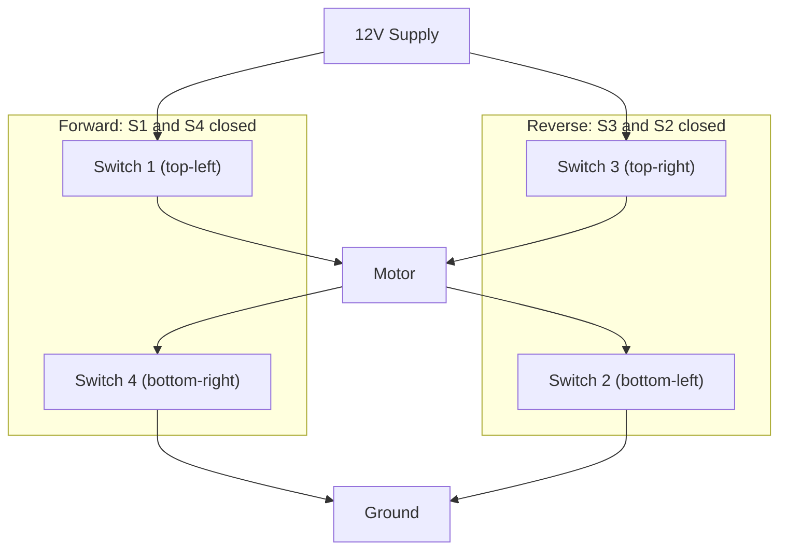

# Differential Drive Motor Control: PWM, H-Bridges, and Your Rover

> **AI Assist Disclosure:** This document was generated with AI assistance (Claude),
> reviewed and refined by Jim The STEAM Clown, and validated against STEAM Clown documentation rules.
> Content accuracy has not yet been fully verified. Use with appropriate judgment.

---

## Overview

You have wired an L298N motor driver and made a motor spin. Now it is time to understand exactly *why* it spins, how to control how *fast* and in what *direction* it spins, and how to get two motors working together to steer a rover. This guide connects the circuits on your bench to real engineering concepts used in electric wheelchairs, warehouse robots, and FIRST Robotics drive trains.

By the end of this guide you will be able to write Arduino code that drives your rover forward, backward, and through turns, and you will know how to debug it when something goes wrong.

---

## Key Vocabulary

| Term | Definition | Example |
|---|---|---|
| PWM (Pulse Width Modulation) | A digital signal that switches rapidly between HIGH and LOW to simulate a variable output level | analogWrite(ENA, 128) sends a 50% duty cycle signal |
| Duty Cycle | The percentage of time a PWM signal is HIGH in one period | 128 out of 255 = roughly 50% duty cycle |
| H-Bridge | A circuit that can send current through a motor in either direction, allowing forward and reverse | The L298N chip contains two H-bridges |
| Motor Driver | An IC that uses small logic signals from a microcontroller to switch high-current paths to a motor | L298N takes 5V logic from the Arduino and switches up to 2A to the motors |
| Differential Drive | A drive system where two independently controlled wheels steer the vehicle by spinning at different speeds | A robot turns left by slowing the left motor and speeding the right motor |
| Speed Ramping | Gradually increasing or decreasing motor speed instead of jumping immediately to full speed or stop | Using a for-loop to step speed from 0 to 255 over 500ms |
| Inrush Current | A large spike of current drawn by a motor the instant it starts from rest | Jumping a motor from 0 to 255 instantly can draw 5 to 10 times normal current |
| Enable Pin | The L298N pin that accepts a PWM signal to control motor speed | ENA controls Motor A speed; ENB controls Motor B speed |
| Input Pins | The L298N pins that set motor direction (IN1/IN2 for Motor A, IN3/IN4 for Motor B) | IN1 HIGH and IN2 LOW = Motor A spins forward |
| Back-EMF | Voltage generated by a spinning motor that pushes back against the supply voltage | Back-EMF is why a motor slows down when it hits a load |

---

## Concept Explanations

### PWM: The Light Dimmer Analogy

Imagine a light switch you flip on and off very fast, 1000 times per second. If it is on half the time and off half the time, the bulb appears half as bright. If it is on 75% of the time, it appears 75% as bright. Your eye averages out the flicker.

A DC motor works the same way. Its spinning mass averages out the rapid on/off pulses. The longer the signal stays HIGH each cycle, the faster the motor spins. That percentage of on-time is the **duty cycle**.

On the Arduino, `analogWrite(pin, value)` controls duty cycle:

| analogWrite Value | Duty Cycle | Motor Behavior |
|---|---|---|
| 0 | 0% | Motor stopped |
| 64 | 25% | Slow |
| 128 | 50% | Medium |
| 192 | 75% | Fast |
| 255 | 100% | Full speed |

**Important:** `analogWrite` does not output a real analog voltage. It outputs a digital pulse train that *averages* to that voltage level. You can verify this with an oscilloscope.


---

### The H-Bridge: Controlling Direction

A plain transistor switch can only turn a motor on or off. An **H-bridge** uses four switches arranged in an H shape to route current through the motor in either direction.



Close S1 and S4: current flows left-to-right through the motor. Forward.
Close S3 and S2: current flows right-to-left through the motor. Reverse.
Close S1 and S3 at the same time: short circuit. Never do this.

The L298N IC handles all of this internally. You control it with logic signals from the Arduino.

| IN1 | IN2 | Motor A Direction |
|---|---|---|
| HIGH | LOW | Forward |
| LOW | HIGH | Reverse |
| LOW | LOW | Stop (coast) |
| HIGH | HIGH | Brake (avoid) |

---

### Differential Drive: Steering with Speed

Your rover has no steering wheel. It turns the same way a tank does: by spinning the two drive wheels at different speeds.

| Left Motor | Right Motor | Rover Movement |
|---|---|---|
| Forward | Forward (same speed) | Straight forward |
| Reverse | Reverse (same speed) | Straight backward |
| Forward fast | Forward slow | Gradual left turn |
| Forward | Stopped | Pivot left |
| Forward | Reverse | Spin in place left |

This is called **differential drive** because the *difference* in wheel speeds determines the turn radius. Electric wheelchairs, the Roomba, Amazon Kiva warehouse robots, and most FIRST Robotics tank-drive robots all use this principle.

---

### Speed Ramping: Being Kind to Your Gearbox

When you tell your motor to jump from 0 to 255 instantly, the motor draws a huge inrush current spike and the gearbox experiences a sharp mechanical jolt. Over time this cracks gear teeth and wears out motor brushes.

Speed ramping gradually increases or decreases speed using a loop:

```arduino
// LEARN: This for-loop steps speed up in small increments.
//        Each step adds 5 to the duty cycle and waits 10ms.
//        The motor accelerates smoothly instead of lurching.
for (int speed = 0; speed <= 255; speed += 5) {
    analogWrite(ENA, speed);
    analogWrite(ENB, speed);
    delay(10);
}
```

Industry uses speed ramping to protect gearboxes, reduce inrush current, and comply with motor controller specifications. The same principle appears in electric vehicle accelerator curves and industrial servo drives.

---

## Wiring Reference: L298N to Arduino Mega

Connect your L298N motor driver to the Arduino Mega using the following pin assignments. Always double-check polarity before powering on.

```text
L298N Pin    Arduino Mega Pin    Purpose
---------    ----------------    -------
ENA          Pin 2               Motor A speed (PWM)
IN1          Pin 3               Motor A direction control
IN2          Pin 4               Motor A direction control
IN3          Pin 5               Motor B direction control
IN4          Pin 6               Motor B direction control
ENB          Pin 7               Motor B speed (PWM)
GND          GND                 Common ground (REQUIRED)
+12V         External 12V supply Motor power supply
+5V (out)    Optional            Can power Arduino if jumper set
Motor A Out  Left motor          Motor A terminals
Motor B Out  Right motor         Motor B terminals
```

**Critical:** The Arduino GND and the L298N GND must be connected together (common ground). Without this, the L298N will not respond to the Arduino's logic signals.

---

## Annotated Arduino Code Example

```arduino
// =============================================================
// Differential Drive Motor Control
// SVCTE Mechatronics - Robots and Rovers Unit 7
// =============================================================

// LEARN: Defining pin numbers as constants makes the code easier
//        to read and update. If you rewire, change it here once.
const int ENA = 2;   // Motor A (left) speed
const int IN1 = 3;   // Motor A direction
const int IN2 = 4;   // Motor A direction
const int IN3 = 5;   // Motor B direction
const int IN4 = 6;   // Motor B direction
const int ENB = 7;   // Motor B (right) speed

// LEARN: Using a constant for speed lets you tune behavior in
//        one place. 180 out of 255 = about 70% duty cycle.
const int CRUISE_SPEED = 180;

// -------------------------------------------------------
// E-STOP: Call stop() immediately if anything goes wrong.
// This is your emergency brake. Always write it first.
// -------------------------------------------------------
void stop() {
    analogWrite(ENA, 0);
    analogWrite(ENB, 0);
    digitalWrite(IN1, LOW);
    digitalWrite(IN2, LOW);
    digitalWrite(IN3, LOW);
    digitalWrite(IN4, LOW);
}

// -------------------------------------------------------
// Drive forward at a given speed (0-255)
// -------------------------------------------------------
void forward(int speed) {
    // LEARN: IN1 HIGH and IN2 LOW tells the H-bridge to
    //        send current through Motor A in the forward direction.
    digitalWrite(IN1, HIGH);
    digitalWrite(IN2, LOW);
    digitalWrite(IN3, HIGH);
    digitalWrite(IN4, LOW);
    analogWrite(ENA, speed);
    analogWrite(ENB, speed);
}

// -------------------------------------------------------
// Drive in reverse at a given speed (0-255)
// -------------------------------------------------------
void reverse(int speed) {
    digitalWrite(IN1, LOW);
    digitalWrite(IN2, HIGH);
    digitalWrite(IN3, LOW);
    digitalWrite(IN4, HIGH);
    analogWrite(ENA, speed);
    analogWrite(ENB, speed);
}

// -------------------------------------------------------
// Turn left: right motor drives, left motor stops
// -------------------------------------------------------
void turnLeft(int speed) {
    // LEARN: Differential drive turns by slowing or stopping
    //        one side. This pivots around the stopped wheel.
    digitalWrite(IN1, LOW);
    digitalWrite(IN2, LOW);   // Left motor stopped
    digitalWrite(IN3, HIGH);
    digitalWrite(IN4, LOW);   // Right motor forward
    analogWrite(ENA, 0);
    analogWrite(ENB, speed);
}

// -------------------------------------------------------
// Turn right: left motor drives, right motor stops
// -------------------------------------------------------
void turnRight(int speed) {
    digitalWrite(IN1, HIGH);
    digitalWrite(IN2, LOW);   // Left motor forward
    digitalWrite(IN3, LOW);
    digitalWrite(IN4, LOW);   // Right motor stopped
    analogWrite(ENA, speed);
    analogWrite(ENB, 0);
}

// -------------------------------------------------------
// Ramp up to speed smoothly to protect the gearbox
// -------------------------------------------------------
void rampForward(int targetSpeed) {
    // LEARN: Stepping in increments of 5 with a 10ms delay
    //        gives a 0.5 second ramp to full speed.
    //        Increase the delay to ramp more slowly.
    for (int s = 0; s <= targetSpeed; s += 5) {
        digitalWrite(IN1, HIGH);
        digitalWrite(IN2, LOW);
        digitalWrite(IN3, HIGH);
        digitalWrite(IN4, LOW);
        analogWrite(ENA, s);
        analogWrite(ENB, s);
        delay(10);
    }
}

void setup() {
    pinMode(ENA, OUTPUT);
    pinMode(IN1, OUTPUT);
    pinMode(IN2, OUTPUT);
    pinMode(IN3, OUTPUT);
    pinMode(IN4, OUTPUT);
    pinMode(ENB, OUTPUT);

    // LEARN: Always start in a known safe state.
    stop();
    Serial.begin(9600);
    Serial.println("Rover ready.");
}

void loop() {
    rampForward(CRUISE_SPEED);   // Smooth start
    delay(2000);                 // Drive forward 2 seconds
    stop();
    delay(500);
    turnLeft(CRUISE_SPEED);      // Pivot left
    delay(600);
    stop();
    delay(500);
    rampForward(CRUISE_SPEED);   // Forward again
    delay(2000);
    stop();
    delay(5000);                 // Pause before repeating
}
```

---

## Common Mistakes and How to Fix Them

| Symptom | Likely Cause | Fix |
|---|---|---|
| Motor does not move at all | Missing common ground between Arduino and L298N | Connect L298N GND to Arduino GND |
| Motor spins in only one direction | IN pins swapped or wired to wrong Arduino pins | Verify IN1/IN2 wiring against the pin table; test each pin with digitalWrite in isolation |
| Motor runs but ignores analogWrite speed | ENA or ENB pin not defined as OUTPUT, or jumper still installed on EN pins | Call pinMode(ENA, OUTPUT) in setup; remove the enable jumper if present |
| Both motors spin but rover drives in a circle | One motor wired in reverse polarity | Swap the two motor terminal wires on the backwards motor |
| Arduino resets when motors start | Motors pulling too much current through Arduino's 5V | Power L298N from an external supply, not the Arduino's 5V pin |
| Speed feels the same at 100 and 255 | Motor stall torque threshold: below a minimum duty cycle the motor does not overcome friction | Find your motor's minimum effective analogWrite value experimentally (typically 80 to 100) |

---

## Check for Understanding

### Recall

**1.** What is duty cycle, and what analogWrite value produces a 50% duty cycle on an Arduino?

**2.** Fill in the table: what direction does Motor A spin for each combination of IN1 and IN2?

```text
IN1     IN2     Motor A Direction
-----   -----   -----------------
HIGH    LOW     ?
LOW     HIGH    ?
LOW     LOW     ?
```

### Application

**3.** Your rover needs to turn right with a wider arc (gradual curve, not a sharp pivot). You are currently using `turnRight()` which stops the right motor completely. How would you modify the code to make the right motor run at 30% speed instead of stopping? Write the two lines you would change.

**4.** A classmate claims that setting `analogWrite(ENA, 255)` on an L298N powered by 9V will make the motor run at 9V. A different classmate says it will run faster than at 6V because the duty cycle is higher. Who is right, and why?

### Debug This Rover

**5.** You upload the code below. The rover's right motor spins forward correctly, but the left motor spins in reverse when it should go forward. The wiring looks correct on the breadboard. What is the bug in the code, and how do you fix it?

```arduino
void forward(int speed) {
    digitalWrite(IN1, LOW);   // Left motor
    digitalWrite(IN2, HIGH);  // Left motor
    digitalWrite(IN3, HIGH);  // Right motor
    digitalWrite(IN4, LOW);   // Right motor
    analogWrite(ENA, speed);
    analogWrite(ENB, speed);
}
```

---

## Safety Notes

**Electrical safety.**
- Maximum supply voltage for the L298N in student lab configurations is 12V. Do not exceed this.
- Never connect motor power directly to the Arduino's 5V or VIN pins. Motors draw far more current than the Arduino can supply safely.
- Always establish common ground between the Arduino and the L298N before powering on.

**Wiring safety.**
- Disconnect power before changing any wiring. Motors draw a high inrush current spike at startup, and live rewiring can damage components or cause burns.
- Double-check polarity on the motor supply before powering on. Reversed polarity can destroy the L298N.

**Software safety.**
- Always write your `stop()` function first, before any other motor function. Test it before testing forward or reverse.
- Include a Serial command or physical button that calls `stop()` so you can halt the rover instantly during testing.
- Never run a rover on a desk or workbench without a tether or a clear perimeter. A rover at full speed will reach the edge of a table in under one second.

---

## Differentiation and Scaffolding

### Tier 1: Foundational

Think of PWM like a ceiling fan with a speed dial. The dial does not change the voltage to the fan motor. Instead, it pulses power on and off very rapidly. More on-time means faster spinning. `analogWrite(pin, 128)` means the signal is HIGH exactly half the time.

Try this minimal example to confirm your motor responds:

```arduino
const int ENA = 2;
const int IN1 = 3;
const int IN2 = 4;

void setup() {
    pinMode(ENA, OUTPUT);
    pinMode(IN1, OUTPUT);
    pinMode(IN2, OUTPUT);
    digitalWrite(IN1, HIGH);
    digitalWrite(IN2, LOW);
    analogWrite(ENA, 180);   // Forward at 70% speed
}

void loop() {
    // Motor runs continuously - no loop code needed for this test
}
```

### Tier 2: Standard

Use the full code example above. Get all four functions (forward, reverse, turnLeft, turnRight) working reliably before adding speed ramping.

### Tier 3: Challenge

Add speed ramping to both the ramp-up and ramp-down phases. Then measure the motor's current draw (with a multimeter in series) at:
- Instant start (no ramp)
- Ramp over 500ms
- Ramp over 1500ms

Record your results and explain the relationship between ramp rate and peak inrush current. Why does this matter for battery life on a mobile robot?

---

## Hands-On Lab Activity: Measure Your PWM Signal

**Equipment:** Oscilloscope, Arduino Mega, L298N, DC motor, jumper wires.

**Procedure:**
1. Connect the oscilloscope probe to the ENA pin and ground.
2. Upload a simple sketch that calls `analogWrite(ENA, 64)` in setup.
3. Measure and record the frequency and duty cycle.
4. Repeat for analogWrite values of 128 and 255.
5. Observe the motor speed at each setting.

**Record your results:**

```text
analogWrite Value    Measured Duty Cycle    Observed Motor Speed
-----------------    -------------------    --------------------
64                   ?                      ?
128                  ?                      ?
255                  ?                      ?
```

**Connect forward:** In the upcoming PID control unit, you will use a wheel encoder to measure actual speed and close the loop between what you command and what the motor actually does. This lab gives you the open-loop baseline.

---

## Real-World Relevance

**Electric wheelchairs** use differential drive because it allows precise, responsive steering with no mechanical linkage. The joystick sends different speed commands to left and right motors.

**Amazon Kiva (now Amazon Robotics)** warehouse robots navigate using differential drive and QR codes on the floor. Speed ramping is essential because they carry loads up to 1,000 lbs and cannot lurch to a start.

**Autonomous lawn mowers** (Husqvarna Automower, Roomba) use differential drive combined with GPS or boundary wire to navigate yard obstacles.

**FIRST Robotics tank drive trains** use the same H-bridge and differential drive principles you are learning now. Teams tune speed ramping constants to prevent brownouts during match play, where six motors starting simultaneously can overwhelm the robot's battery.

---

## Extension Pathways

- **Closed-loop speed control with encoders.** Add wheel encoders to your rover and implement a simple proportional controller that maintains a target speed regardless of load. This leads directly into the PID unit.
- **Adafruit Motor Shield v2.** Explore this library-based abstraction that hides the H-bridge details and adds I2C control. Compare the tradeoffs versus direct L298N control.
- **FIRST Robotics drive train research.** Compare tank drive, swerve drive, and mecanum drive. Explain the tradeoffs in terms of mechanical complexity, software complexity, and maneuverability.
- **Brushless DC motors and ESCs.** Research how ESCs (Electronic Speed Controllers) replace the H-bridge in drone and RC car applications. Why can an ESC handle much higher currents than an L298N?

---

## Sources

- [L298N Motor Driver Datasheet, STMicroelectronics](https://www.st.com/resource/en/datasheet/l298.pdf)
- [Arduino analogWrite() Reference](https://www.arduino.cc/reference/en/language/functions/analog-io/analogwrite/)
- [STEAM Clown AI Documentation Rules](https://raw.githubusercontent.com/jimTheSTEAMClown/Robots-Rovers-Project-Template/refs/heads/main/AI-Rules/AI-Rules-Documentation-Projects.md)
- [Adafruit Motor Shield v2 Documentation](https://learn.adafruit.com/adafruit-motor-shield-v2-for-arduino)
- [FIRST Robotics Drive Train Overview](https://docs.wpilib.org/en/stable/docs/software/hardware-apis/motors/wpi-drive-classes.html)
